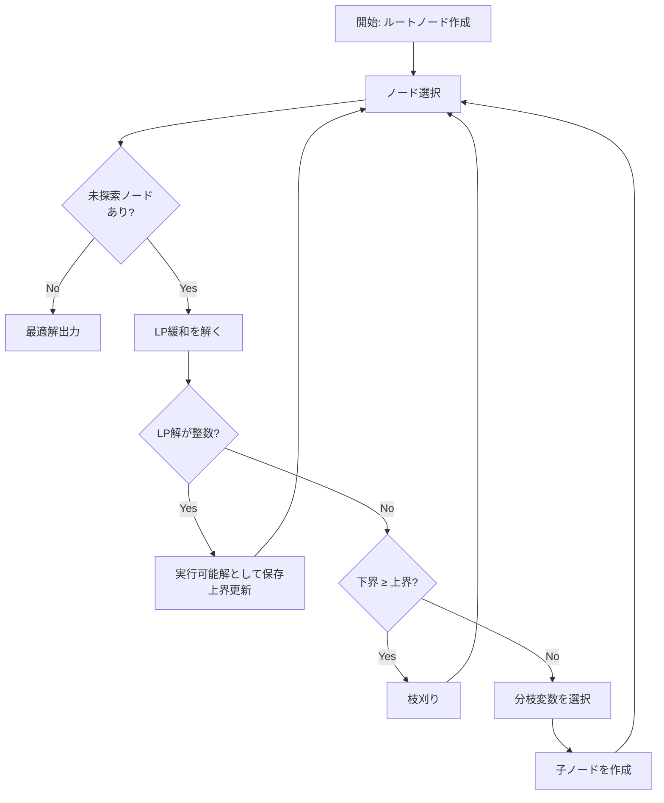
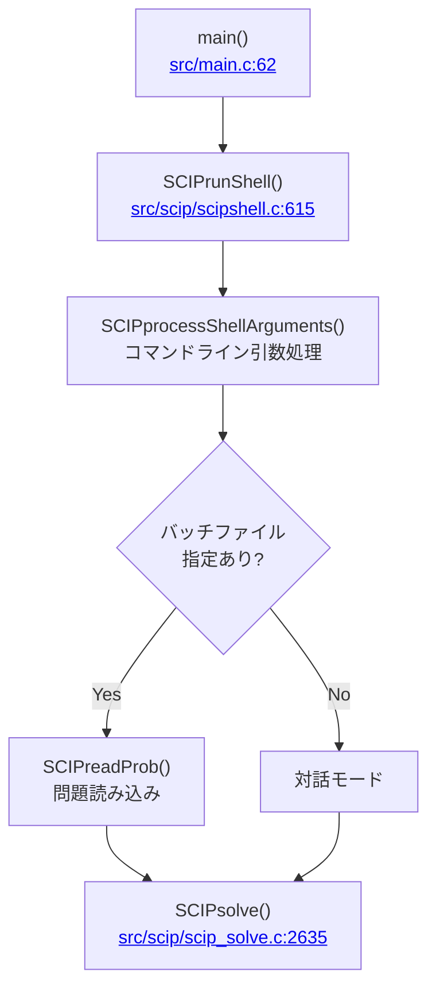
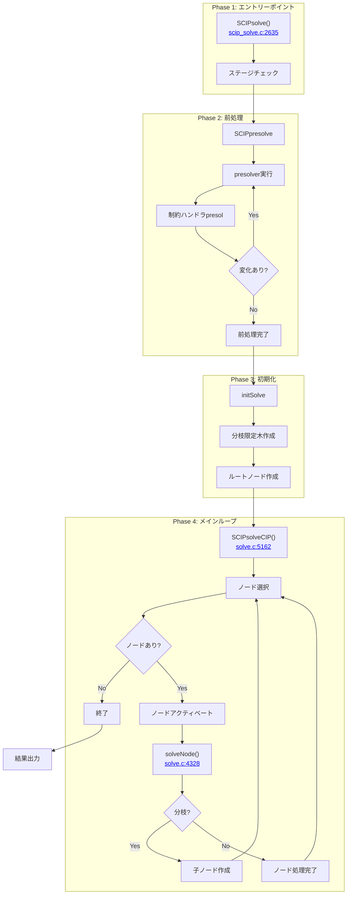
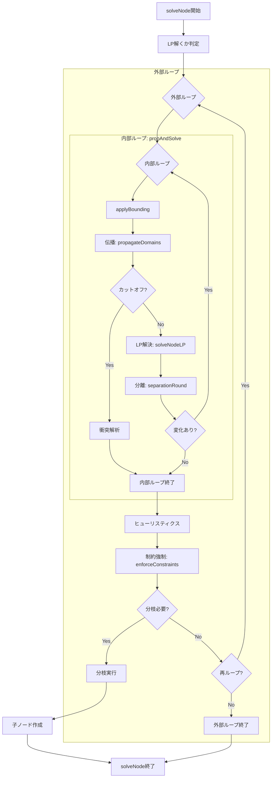
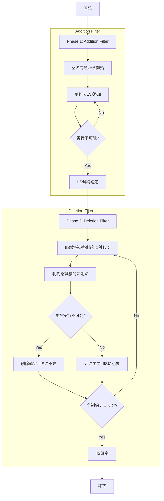

:::message
この記事ではSCIP **v10.0.0** を対象としています。コード参照は [https://github.com/scipopt/scip/tree/v10.0.0](https://github.com/scipopt/scip/tree/v10.0.0) に基づきます。
:::

## はじめに

数理最適化の世界で「ソルバーの中身を理解する」というのは、なかなか敷居の高いタスクである。商用ソルバーはブラックボックスであり、オープンソースのソルバーであっても数十万行のコードを前に途方に暮れることが少なくない。

本記事では、世界最高峰のオープンソースMIPソルバーである **SCIP (Solving Constraint Integer Programs)** の内部構造を、実際のコードを追いながら解説する。対象読者はLPやMIPの基礎的な定式化は理解しているが、ソルバーの内部実装には詳しくない実務者・エンジニアを想定している。

## この記事で扱う内容

1. **オーソドックスな分枝限定法** - まずは教科書的なアルゴリズムを復習
2. **SCIPのアルゴリズム全体像** - 実装を追いながら理解を深める
3. **IIS (Irreducible Infeasible Subsystem)** - SCIP 10.0で新規追加された機能
4. **デバッグログを追う** - 実際の実行ログで理解を確認

## 環境構築

本記事で使用するリポジトリは、SCIP公式リポジトリ（`scipopt/scip`）のtag `v10.0.0` をフォークし、**デバッグログ出力を追加**したものである。オリジナルとの差分は、求解処理の各フェーズで `[DEBUG]` プレフィックス付きのログを出力する `printf` 文を追加した点のみである。

```bash
# リポジトリのクローン（v10.0.0-debugブランチを指定）
git clone -b v10.0.0-debug https://github.com/j-i-k-o/scip_for_debug
cd scip_for_debug

# ビルド（cmakeを使用）
mkdir build
cd build
cmake ..
make -j4

# 実行確認
./bin/scip --version
```

デモ用の問題ファイルとバッチファイルは `demo/` ディレクトリに配置されている：

```
demo/
├── test_problem.lp      # 小規模MIP問題（0-1ナップサック風）
├── infeasible_problem.lp # 実行不能問題（IISデモ用）
├── batch.txt            # test_problem.lp 用バッチファイル
└── iis_batch.txt        # IIS計算用バッチファイル
```

実行例：
```bash
# MIP問題を解く
./bin/scip -b demo/batch.txt

# IISを計算する
./bin/scip -b demo/iis_batch.txt
```

---

# 1. 背景

## 1.1 SCIPとは

SCIP (Solving Constraint Integer Programs) は、ドイツのZuse Institute Berlin (ZIB)で開発されている、世界最高峰のオープンソース混合整数計画ソルバーである。約**79万行**のC言語コードで実装されており、商用ソルバーに匹敵する性能を持つ。

SCIPの特徴は以下の通りである：

- **制約整数計画 (Constraint Integer Programming)** のフレームワーク
- **プラグインアーキテクチャ** による高い拡張性
- 豊富なアルゴリズム群（63種類のヒューリスティクス、22種類のカット生成器など）
- 学術研究から実務応用まで幅広く利用

## 1.2 なぜソースコードを読むのか

ソルバーをブラックボックスとして使うだけでも多くの問題は解けるが、以下のような場面では内部の理解が重要になる：

- **パフォーマンスチューニング**: どのパラメータが何に影響するのかを理解する
- **カスタムプラグイン開発**: 問題固有のヒューリスティクスやカットを追加する
- **デバッグ**: 想定外の挙動の原因を特定する
- **研究**: 新しいアルゴリズムを提案・実装する

:::message
**要点**
- SCIPは約79万行のC言語で実装されたオープンソースMIPソルバー
- プラグインアーキテクチャにより高い拡張性を持つ
:::

---

# 2. オーソドックスな分枝限定法の説明

SCIPの実装を見る前に、まずは教科書的な分枝限定法 (Branch-and-Bound) を復習する。ここでは**カット（切除平面）には触れず**、純粋な分枝限定法のみを扱う。カット生成については後のSCIPの節で詳しく解説する。

## 2.1 混合整数計画問題とLP緩和

混合整数計画問題 (MIP) は以下の形式で表される：

$$
\begin{align}
\min \quad & c^T x \\
\text{s.t.} \quad & Ax \leq b \\
& x_i \in \mathbb{Z} \quad (i \in I)
\end{align}
$$

ここで $I$ は整数制約を持つ変数のインデックス集合である。

**LP緩和 (Linear Programming Relaxation)** とは、整数制約を取り除いた問題である：

$$
\begin{align}
\min \quad & c^T x \\
\text{s.t.} \quad & Ax \leq b
\end{align}
$$

LP緩和の重要な性質は以下の通り：

1. **下界の提供**: LP緩和の最適値は元のMIPの最適値の下界を与える
2. **効率的な解法**: シンプレックス法や内点法で多項式時間で解ける
3. **整数解の可能性**: LP緩和の最適解がたまたま整数なら、それは元のMIPの最適解

## 2.2 分枝限定法の基本アルゴリズム

分枝限定法は「分割統治」の考え方に基づく。問題を部分問題に分割し、各部分問題を解いて最適解を見つける。



### アルゴリズムの詳細

**1. 初期化**
- ルートノードを作成し、未探索ノードリストに追加
- 上界（現在の最良解）を $+\infty$ に設定

**2. ノード選択**
- 未探索ノードリストからノードを選択する
- 選択戦略には「最良優先 (Best-First)」「深さ優先 (Depth-First)」などがある

**3. LP緩和の解決**
- 選択したノードのLP緩和を解く
- LP最適解とその目的関数値（下界）を得る

**4. 枝刈りの判定**
- LP緩和が実行不可能 → そのノードを枝刈り
- 下界 ≥ 上界 → そのノードを枝刈り（より良い解は存在しない）

**5. 整数性の確認**
- LP解が整数なら、新しい実行可能解として保存し、上界を更新

**6. 分枝**
- 整数制約を満たさない変数 $x_j$（値が $f$ で非整数）を選択
- 2つの子ノードを作成：
  - $x_j \leq \lfloor f \rfloor$
  - $x_j \geq \lceil f \rceil$

## 2.3 双対ギャップと最適性の証明

分枝限定法の終了時、以下の条件のいずれかが成立する：

1. **最適解発見**: 全ての未探索ノードが枝刈りされ、上界 = 下界
2. **実行不可能性の証明**: 全てのノードでLP緩和が実行不可能
3. **時間制限**: ギャップが残った状態で終了

**双対ギャップ (Duality Gap)** は最適性の指標である：

$$
\text{Gap} = \frac{\text{上界} - \text{下界}}{|\text{上界}|} \times 100\%
$$

Gap = 0% が証明されれば、現在の最良解が最適解であることが保証される。

## 2.4 ノード選択戦略

ノード選択戦略は探索効率に大きく影響する。主な戦略を比較する：

| 戦略 | 特徴 | メモリ | 用途 |
|-----|------|-------|-----|
| **深さ優先** | スタック的に探索 | 少 | メモリ制約がある場合 |
| **最良優先** | 下界が最小のノードを選択 | 多 | 下界の改善を優先 |
| **Best Estimate** | 推定目的関数値で選択 | 多 | 良い解を早く見つけたい場合 |

:::message
**要点**
- 分枝限定法はLP緩和を利用して下界を計算し、分割統治で探索する
- 枝刈りにより探索空間を効率的に削減する
- ノード選択が探索効率を大きく左右する
:::

---

# 3. SCIPのアルゴリズム全体像

教科書的���分枝限定法を復習したところで、SCIPの実装を見ていく。SCIPは単純な分枝限定法に加えて、カット生成、ヒューリスティクス、伝播など多くの機能を統合した **分枝カット法 (Branch-and-Cut)** を実装している。

## 3.1 アーキテクチャ概要と求解処理フロー

### ディレクトリ構造

SCIPのソースコードは以下のような構造になっている：

```
src/
├── scip/           # コアソルバー実装 (410 .cファイル、約79.3万行)
│   ├── cons_*.c    # 制約ハンドラ (34種類)
│   ├── heur_*.c    # 発見的手法 (63種類)
│   ├── sepa_*.c    # 分離器 (22種類)
│   ├── branch_*.c  # 分枝規則 (16種類)
│   ├── nodesel_*.c # ノード選択 (8種類)
│   ├── prop_*.c    # 伝播器 (12種類)
│   ├── presol_*.c  # 前処理器 (18種類)
│   └── iisfinder_*.c # IISファインダー (1種類)
├── lpi/            # LPソルバーインターフェース
├── blockmemshell/  # メモリ管理
├── symmetry/       # 対称性処理
└── objscip/        # C++ラッパー
```

### プラグインシステム

SCIPの最大の特徴は**プラグインアーキテクチャ**である。ソルバーのコア部分と個別のアルゴリズムが分離されており、新しいアルゴリズムを容易に追加できる。

```c
// src/scip/struct_set.h:74-200 より抜粋
struct SCIP_Set {
    SCIP_CONSHDLR**       conshdlrs;    // 制約ハンドラ配列
    SCIP_HEUR**           heurs;        // 発見的手法配列
    SCIP_SEPA**           sepas;        // 分離器配列
    SCIP_PROP**           props;        // 伝播器配列
    SCIP_BRANCHRULE**     branchrules;  // 分枝規則配列
    SCIP_NODESEL**        nodesels;     // ノード選択戦略配列
    // 各プラグインは優先度順にソートされている
};
```

各プラグインは**優先度 (priority)** を持ち、高い優先度のものから順に実行される。

### コアデータ構造

SCIPの中心となるデータ構造を見てみる。

```c
// src/scip/struct_scip.h:71-119 より
struct Scip {
    SCIP_MEM*             mem;          // メモリ管理
    SCIP_SET*             set;          // 設定とプラグイン
    SCIP_STAT*            stat;         // 統計情報
    SCIP_PROB*            origprob;     // 元問題
    SCIP_PROB*            transprob;    // 変換後の問題
    SCIP_PRIMAL*          primal;       // 主問題データ（実行可能解）
    SCIP_TREE*            tree;         // 分枝限定木
    SCIP_LP*              lp;           // LP緩和
    SCIP_CONFLICT*        conflict;     // 衝突解析
    SCIP_SEPASTORE*       sepastore;    // カット保管庫
    SCIP_CUTPOOL*         cutpool;      // カットプール
    SCIP_IIS*             iis;          // 実行不可能部分システム
    // ...
};
```

### コマンドライン実行からSCIPsolve()までの流れ

SCIPをコマンドラインから起動した場合、以下の流れで`SCIPsolve()`に到達する。



**詳細な呼び出しチェーン:**

1. **[main()](https://github.com/scipopt/scip/blob/v10.0.0/src/main.c#L62)**: エントリーポイント。`SCIPrunShell()`を呼び出す
2. **[SCIPrunShell()](https://github.com/scipopt/scip/blob/v10.0.0/src/scip/scipshell.c#L615)**: SCIPインスタンスを作成し、デフォルトプラグインを登録
3. **SCIPprocessShellArguments()**: バッチファイルや対話モードを処理
4. **[SCIPsolve()](https://github.com/scipopt/scip/blob/v10.0.0/src/scip/scip_solve.c#L2635)**: 求解処理のエントリーポイント

### 求解処理フロー全体像

`SCIPsolve()`以降の求解処理は以下のフローで進む。



---

## 3.2 ノード処理の詳細

各ノードでの処理は `solveNode()` 関数で行われる。これがSCIPの**最重要関数**の一つである。

**参照**: [src/scip/solve.c:4328 - solveNode()](https://github.com/scipopt/scip/blob/v10.0.0/src/scip/solve.c#L4328)

### solveNode()の構造



### propAndSolve() - 核心処理

`propAndSolve()` は**伝播・LP解決・分離**を繰り返すループの核心部分である。

**参照**: [src/scip/solve.c:3950 - propAndSolve()](https://github.com/scipopt/scip/blob/v10.0.0/src/scip/solve.c#L3950)

```c
// solve.c - propAndSolve() の疑似コード
static SCIP_RETCODE propAndSolve(...) {
    // 1. 伝播 (Domain Propagation)
    if( propagate ) {
        SCIP_CALL( propagateDomains(...) );
        if( *cutoff ) {
            // 矛盾検出 → 衝突解析
            SCIP_CALL( SCIPconflictAnalyze(...) );
            return SCIP_OKAY;
        }
    }

    // 2. LP解決
    if( solvelp && !(*cutoff) ) {
        SCIP_CALL( solveNodeLP(...) );
        *lpsolved = TRUE;
    }

    // 3. 分離ラウンド（カット生成）
    if( *lpsolved && !(*cutoff) ) {
        while( nsepastalls < maxsepastalls ) {
            SCIP_CALL( separationRound(..., &separated) );
            if( separated ) {
                SCIP_CALL( solveNodeLP(...) );  // カット追加後LP再解決
            } else {
                nsepastalls++;
            }
        }
    }

    // 4. ヒューリスティクス
    if( *lpsolved && !(*cutoff) ) {
        SCIP_CALL( SCIPprimalHeuristics(..., SCIP_HEURTIMING_AFTERLPNODE) );
    }

    return SCIP_OKAY;
}
```

### 衝突解析 (Conflict Analysis)

**衝突解析**は、実行不可能なノードから「学習」して将来の探索を高速化する技術である。上のフローチャートで「カットオフ」が発生した際に呼び出される。

**参照**: [src/scip/conflict_graphanalysis.c](https://github.com/scipopt/scip/blob/v10.0.0/src/scip/conflict_graphanalysis.c)

基本的な考え方：
1. ノードが実行不可能になった原因を分析
2. その原因となる変数固定の組み合わせを特定
3. **衝突制約 (conflict constraint)** を生成
4. 以後、同じ組み合わせを避ける

### 分枝時の状態復元

分枝限定法では、ノード間でLP状態を効率的に復元する必要がある。SCIPは**ノードタイプの階層**でこれを実現している。

**参照**: [src/scip/tree.c](https://github.com/scipopt/scip/blob/v10.0.0/src/scip/tree.c)

| ノードタイプ | 保存する情報 | メモリ使用量 |
|------------|------------|------------|
| Subroot | 完全なLP状態 | 大 |
| Fork | LP基底情報 | 中 |
| Pseudofork | 複数の境界変更 | 小 |
| Junction | 単一の境界変更 | 最小 |

ノードをアクティベートする際、最も近いForkノードまで遡ってLP基底を復元し、そこから境界変更を順次適用する。

---

## 3.3 プラグイン詳細

SCIPには多数のプラグインが実装されている。ここでは主要なものをカテゴリ別に紹介する。

### 分枝変数の選択（分枝規則）

教科書的なB&Bでは分枝変数の選択戦略は単純だが、SCIPでは16種類の分枝規則がプラグインとして実装されている。

**Most Fractional**
最も0.5に近い（最も「迷っている」）変数を選択する。

$$
\arg\max_{j \in I} \min(f_j, 1 - f_j)
$$

ここで $f_j = x_j - \lfloor x_j \rfloor$ は小数部分。

**疑似コスト分枝 (Pseudo-Cost Branching)**
過去の分枝履歴から、分枝による目的関数値の変化を予測する。

$$
\text{score}_j = (1 - \mu) \cdot \min(\psi_j^-, \psi_j^+) + \mu \cdot \max(\psi_j^-, \psi_j^+)
$$

ここで $\psi_j^-$, $\psi_j^+$ は下方向・上方向の疑似コスト。

**強分枝 (Strong Branching)**
実際に分枝してLP緩和を解き、最も目的関数値が改善する変数を選択する。計算コストは高いが精度が高い。

:::details branch_relpscost（信頼性疑似コスト）- デフォルト
**ファイル**: [src/scip/branch_relpscost.c](https://github.com/scipopt/scip/blob/v10.0.0/src/scip/branch_relpscost.c)

疑似コストと信頼性を組み合わせた分枝。初期段階では強分枝、後に疑似コストを使用。
:::

:::details branch_fullstrong（完全強分枝）
**ファイル**: [src/scip/branch_fullstrong.c](https://github.com/scipopt/scip/blob/v10.0.0/src/scip/branch_fullstrong.c)

全候補変数でLPを解いて最適な変数を選択。高精度だが高コスト。
:::

:::details branch_pscost（疑似コスト）
**ファイル**: [src/scip/branch_pscost.c](https://github.com/scipopt/scip/blob/v10.0.0/src/scip/branch_pscost.c)

過去の分枝履歴から疑似コストを計算。
:::

### ノード選択 (8種類)

:::details nodesel_estimate（推定）- デフォルト
**ファイル**: [src/scip/nodesel_estimate.c](https://github.com/scipopt/scip/blob/v10.0.0/src/scip/nodesel_estimate.c)

LP目的関数値と疑似コストから推定値を計算し、最良推定値のノードを選択。
:::

:::details nodesel_bfs（幅優先）
**ファイル**: [src/scip/nodesel_bfs.c](https://github.com/scipopt/scip/blob/v10.0.0/src/scip/nodesel_bfs.c)

下界が最小のノードを選択。
:::

:::details nodesel_dfs（深さ優先）
**ファイル**: [src/scip/nodesel_dfs.c](https://github.com/scipopt/scip/blob/v10.0.0/src/scip/nodesel_dfs.c)

最も深いノードを選択。メモリ効率が良い。
:::

### 制約ハンドラ (34種類)

制約ハンドラ（`SCIP_CONSHDLR`）は**複数の役割**を持つ統一的なプラグインである。

| フェーズ | コールバック | 処理内容 |
|---------|-------------|----------|
| 前処理 | `conspresol` | 制約の簡略化、冗長制約削除 |
| 伝播 | `consprop` | 変数境界の推論 |
| 分離 | `conssepalp` | カット生成 |
| 強制 | `consenfolp` | LP解が制約を満たすか確認 |
| チェック | `conscheck` | 解の実行可能性検証 |

:::details cons_linear（線形制約ハンドラ）- 約18,900行
**ファイル**: [src/scip/cons_linear.c](https://github.com/scipopt/scip/blob/v10.0.0/src/scip/cons_linear.c)

線形制約 $l \leq a^T x \leq u$ を処理する最も基本的な制約ハンドラ。

**前処理での処理**:
- 係数強化: MIR技術で係数を改善
- 境界伝播: 制約から変数境界を導出
- 制約タイプアップグレード: より特化した制約ハンドラへ変換

**伝播での処理**:
線形制約 $\sum_i a_i x_i \leq b$ から、各変数の上界を導出。
:::

:::details cons_setppc（集合被覆/分割/充填制約）
**ファイル**: [src/scip/cons_setppc.c](https://github.com/scipopt/scip/blob/v10.0.0/src/scip/cons_setppc.c)

二値変数の集合制約を処理する。

**3つの制約タイプ**:
- **Partitioning**: $x_1 + x_2 + ... + x_n = 1$（ちょうど1つが1）
- **Packing**: $x_1 + x_2 + ... + x_n \leq 1$（高々1つが1）
- **Covering**: $x_1 + x_2 + ... + x_n \geq 1$（少なくとも1つが1）
:::

:::details cons_knapsack（ナップサック制約）
**ファイル**: [src/scip/cons_knapsack.c](https://github.com/scipopt/scip/blob/v10.0.0/src/scip/cons_knapsack.c)

ナップサック制約 $\sum_i w_i x_i \leq C$（$x_i \in \{0, 1\}$）を処理。

**カバー不等式の生成**:
カバー $C = \{i : \sum_{i \in C} w_i > C\}$ に対して：
$$
\sum_{i \in C} x_i \leq |C| - 1
$$
:::

:::details cons_indicator（指示制約）
**ファイル**: [src/scip/cons_indicator.c](https://github.com/scipopt/scip/blob/v10.0.0/src/scip/cons_indicator.c)

指示制約 $y = 1 \Rightarrow a^T x \leq b$ を処理。Big-M法ではなく、専用の分枝・伝播・カット生成を実装。
:::

:::details cons_nonlinear（非線形制約）
**ファイル**: [src/scip/cons_nonlinear.c](https://github.com/scipopt/scip/blob/v10.0.0/src/scip/cons_nonlinear.c)

非線形制約を処理する。MINLP (Mixed-Integer Nonlinear Programming) のサポート。
:::

### カット生成器 (22種類)

カット（有効不等式）を生成してLP緩和を強化する。

:::details sepa_gomory（Gomory混合整数丸めカット）
**ファイル**: [src/scip/sepa_gomory.c](https://github.com/scipopt/scip/blob/v10.0.0/src/scip/sepa_gomory.c)（約1700行）

**理論**:
LP最適基底の行から生成。基底行 $x_i + \sum_j a_{ij} x_j = b_i$ に対して：

$$
\sum_j f(a_{ij}) x_j \geq f(b_i)
$$

ここで $f$ はMIR関数。
:::

:::details sepa_zerohalf（ゼロハーフカット）
**ファイル**: [src/scip/sepa_zerohalf.c](https://github.com/scipopt/scip/blob/v10.0.0/src/scip/sepa_zerohalf.c)（約5000行）

制約の線形結合で、係数が全て偶数だが右辺が奇数となるものを見つける。
:::

:::details sepa_clique（クリークカット）
**ファイル**: [src/scip/sepa_clique.c](https://github.com/scipopt/scip/blob/v10.0.0/src/scip/sepa_clique.c)（約2500行）

含意グラフでクリーク（互いに矛盾する変数の集合）を見つけ、$x_1 + x_2 + ... + x_k \leq 1$ を生成。
:::

:::details sepa_mcf（多品種フローカット）
**ファイル**: [src/scip/sepa_mcf.c](https://github.com/scipopt/scip/blob/v10.0.0/src/scip/sepa_mcf.c)

問題構造から多品種フローネットワークを検出し、フローカットを生成。
:::

### ヒューリスティクス (63種類)

実行可能解を探索するヒューリスティクス。大きく3つのカテゴリに分類される。

#### Diving系（16種類）

LP解から出発して変数を固定していく「潜行」型のヒューリスティクス。

:::details heur_fracdiving（分数潜行）
**ファイル**: [src/scip/heur_fracdiving.c](https://github.com/scipopt/scip/blob/v10.0.0/src/scip/heur_fracdiving.c)

最も0.5に近い分数変数を選択して固定する。
:::

:::details heur_guideddiving（ガイド付き潜行）
**ファイル**: [src/scip/heur_guideddiving.c](https://github.com/scipopt/scip/blob/v10.0.0/src/scip/heur_guideddiving.c)

既知の実行可能解（ガイド解）に近づくように変数を固定する。
:::

:::details heur_pscostdiving（疑似コスト潜行）
**ファイル**: [src/scip/heur_pscostdiving.c](https://github.com/scipopt/scip/blob/v10.0.0/src/scip/heur_pscostdiving.c)

疑似コストに基づいて変数を選択・固定する。
:::

#### LNS系（Large Neighborhood Search）

現在の解の近傍を探索する。

:::details heur_rins（RINS: Relaxation Induced Neighborhood Search）
**ファイル**: [src/scip/heur_rins.c](https://github.com/scipopt/scip/blob/v10.0.0/src/scip/heur_rins.c)

現在の最良整数解とLP解で**値が一致する変数**を固定し、残りの問題を解く。
:::

:::details heur_rens（RENS: Relaxation Enforced Neighborhood Search）
**ファイル**: [src/scip/heur_rens.c](https://github.com/scipopt/scip/blob/v10.0.0/src/scip/heur_rens.c)

LP解の整数部分を固定し、残りを解く。
:::

:::details heur_alns（ALNS: Adaptive Large Neighborhood Search）
**ファイル**: [src/scip/heur_alns.c](https://github.com/scipopt/scip/blob/v10.0.0/src/scip/heur_alns.c)

複数の破壊・修復オペレーターを**動的に選択**する。
:::

#### Rounding系

LP解を丸めて整数解を得る。

:::details heur_rounding（単純丸め）
**ファイル**: [src/scip/heur_rounding.c](https://github.com/scipopt/scip/blob/v10.0.0/src/scip/heur_rounding.c)

LP解を最も近い整数に丸める。
:::

:::details heur_feaspump（実行可能性ポンプ）
**ファイル**: [src/scip/heur_feaspump.c](https://github.com/scipopt/scip/blob/v10.0.0/src/scip/heur_feaspump.c)

LP解と整数点を交互に行き来して実行可能解を見つける。
:::

### 伝播器 (12種類)

変数境界を縮小してドメインを削減する。

:::details prop_pseudoobj（疑似目的関数伝播）
**ファイル**: [src/scip/prop_pseudoobj.c](https://github.com/scipopt/scip/blob/v10.0.0/src/scip/prop_pseudoobj.c)

現在の変数境界から計算される疑似目的関数値と、既知の上界を比較して境界を縮小。
:::

:::details prop_rootredcost（ルート被約費用伝播）
**ファイル**: [src/scip/prop_rootredcost.c](https://github.com/scipopt/scip/blob/v10.0.0/src/scip/prop_rootredcost.c)

ルートノードのLP被約費用を利用した境界縮小。
:::

:::details prop_obbt（最適化ベース境界強化）
**ファイル**: [src/scip/prop_obbt.c](https://github.com/scipopt/scip/blob/v10.0.0/src/scip/prop_obbt.c)

各変数に対してLP最適化を行い、境界を縮小。計算コストは高いが強力。
:::

### 前処理器 (18種類)

求解前に問題を簡略化する。

:::details presol_trivial（自明前処理）
**ファイル**: [src/scip/presol_trivial.c](https://github.com/scipopt/scip/blob/v10.0.0/src/scip/presol_trivial.c)

最高優先度。空制約、単一変数制約の処理。
:::

:::details presol_gateextraction（ゲート抽出）
**ファイル**: [src/scip/presol_gateextraction.c](https://github.com/scipopt/scip/blob/v10.0.0/src/scip/presol_gateextraction.c)

論理制約の組み合わせからAND/ORゲートを検出。
:::

:::details presol_domcol（支配列）
**ファイル**: [src/scip/presol_domcol.c](https://github.com/scipopt/scip/blob/v10.0.0/src/scip/presol_domcol.c)

支配される変数を検出・削除。
:::

### プラグイン一覧表

SCIP v10.0.0に含まれるプラグイン数：

| カテゴリ | 数 | 主なもの |
|---------|---|---------|
| 制約ハンドラ | 34 | linear, setppc, knapsack, indicator, nonlinear |
| 分離器 | 22 | gomory, zerohalf, clique, mcf, impliedbounds |
| ヒューリスティクス | 63 | fracdiving, rins, alns, feaspump, rounding |
| 伝播器 | 12 | pseudoobj, rootredcost, vbounds, obbt |
| 前処理器 | 18 | trivial, gateextraction, domcol, sparsify |
| 分枝規則 | 16 | relpscost, fullstrong, pscost |
| ノード選択 | 8 | estimate, dfs, bfs, uct |
| IISファインダー | 1 | greedy |

:::message
**要点**
- SCIPはプラグインアーキテクチャにより高い拡張性を持つ
- `solveNode()` で伝播・LP解決・分離・ヒューリスティクスを繰り返す
- 衝突解析はカットオフ検出時に呼び出され、学習を行う
:::

---

# 4. 実際にデバッグログとともに見てみる

ここまでの解説を、実際のデバッグログで確認する。

## 4.1 小さな問題での実行例

まず、小さなMIP問題 `test_problem.lp` を解いてみる。

**test_problem.lp**（0-1ナップサック風の問題）:
```
Maximize
 obj: 10 x1 + 9 x2 + 8 x3 + 7 x4 + 6 x5 + 5 x6 + 4 x7 + 3 x8 + 2 x9 + x10

Subject To
 c1: 7 x1 + 6 x2 + 5 x3 + 4 x4 + 3 x5 + 2 x6 + x7 + x8 + x9 + x10 <= 15
 c2: x1 + 2 x2 + 3 x3 + 4 x4 + 5 x5 + 6 x6 + 7 x7 + 6 x8 + 5 x9 + 4 x10 <= 18
 c3: 2 x1 + x2 + 2 x3 + x4 + 2 x5 + x6 + 2 x7 + x8 + 2 x9 + x10 <= 8
 c4: x1 + x2 + x3 + x4 + x5 + x6 + x7 + x8 + x9 + x10 <= 6
 c5: 3 x1 + 2 x3 + x5 + 3 x7 + 2 x9 <= 6
 c6: 2 x2 + 3 x4 + 4 x6 + 2 x8 + x10 <= 7

Bounds
 0 <= x1 <= 1
 ...
 0 <= x10 <= 1

Generals
 x1 x2 x3 x4 x5 x6 x7 x8 x9 x10
End
```

**batch.txt**:
```
read test_problem.lp
optimize
quit
```

**実行**:
```bash
./bin/scip -b batch.txt
```

この問題は10個の0-1変数、6つの制約を持つ小さな問題で、SCIPの動作を観察するのに適している。

## 4.2 大規模問題の実行

ベンチマーク問題 `air05.mps.gz`（7195変数、426制約）を解いた際のログを見る。

### Phase 2: 前処理フェーズ

```
[DEBUG] SCIPsolve() 開始 - メイン求解エントリーポイント
[DEBUG] Phase 2: SCIPpresolve() 開始 - 前処理フェーズ
[DEBUG] presol <trivial> 実行開始 (round=0, timing=4)
[DEBUG] presol <trivial> 完了: result=DIDNOTFIND, 累計固定=0, ...
[DEBUG] conshdlr <linear> presol開始 (conss=426, round=0, timing=4)
[DEBUG] conshdlr <linear> presol完了: result=DIDNOTFIND, ...
```

前処理の流れ：
1. `trivial` presolver が最初に実行（最高優先度）
2. `linear` 制約ハンドラの前処理が実行
3. 変化があれば繰り返し、なければ次のタイミングへ

```
(round 1, exhaustive) 0 del vars, 18 del conss, ...
(round 2, exhaustive) 0 del vars, 18 del conss, ..., 408 upgd conss, ...
```

- `del vars`: 削除された変数数
- `del conss`: 削除された制約数
- `upgd conss`: アップグレードされた制約数（linear → setppcなど）

### 制約のアップグレード

```
[DEBUG] conshdlr <setppc> presol開始 (conss=408, round=2, timing=4)
```

`linear` 制約ハンドラの前処理で、係数が全て1の線形制約が `setppc`（集合分割/被覆/充填）にアップグレードされている。

### 前処理による変数固定

```
(round 4, exhaustive) 711 del vars, 68 del conss, ...
[DEBUG] conshdlr <setppc> presol完了: result=SUCCESS, 累計固定=709, ...
```

setppc制約ハンドラの前処理で709個の変数が固定されている。

---

# 5. IISの説明

IIS (Irreducible Infeasible Subsystem) は、実行不可能な問題に対して**その原因となる最小の制約集合**を特定する機能である。**SCIP v10.0.0で新規追加された**。

## 5.1 SCIP v10.0.0の新機能

2024年にリリースされたSCIP 10.0は、以下のような新機能を含む：

| 機能 | 説明 |
|-----|------|
| **IIS検出** | 実行不能問題の原因特定 |
| **厳密解法モード** | 有理数演算によるMIP求解 |
| **一般化解像度衝突解析** | より強力な衝突学習 |

本セクションではIIS検出機能を解説する。

## 5.2 IISとは

**定義**: IISは以下の性質を満たす制約の部分集合である：

1. **実行不可能**: IIS内の制約だけで問題が実行不可能になる
2. **既約 (Irreducible)**: 任意の1つの制約を削除すれば実行可能になる

IISは実行不可能な問題のデバッグに非常に有用である。数百の制約がある問題でも、IISは数個の制約に絞り込まれることが多い。

## 5.3 Greedyアルゴリズム

SCIPのデフォルトIISファインダーは **2フェーズのGreedyアルゴリズム** を使用する。

**参照**: [src/scip/iisfinder_greedy.c](https://github.com/scipopt/scip/blob/v10.0.0/src/scip/iisfinder_greedy.c)



### Phase 1: Addition Filter

空の問題から始めて、制約を1つずつ追加していく。実行不可能になった時点で停止。

### Phase 2: Deletion Filter

IIS候補から制約を1つずつ試験的に削除し、まだ実行不可能ならその制約は不要（削除確定）。

### バッチ処理による高速化

SCIPの実装では、複数の制約をまとめて削除してテストする**バッチ処理**を行う。これにより計算量を削減している。

## 5.4 使用方法

### SCIPシェルでの使用

```
SCIP> read infeasible_problem.lp
SCIP> optimize
...
SCIP Status: problem is solved [infeasible]

SCIP> iis                    # IIS計算
Computing IIS...
IIS computed: 2 constraints

SCIP> display iis            # IIS表示
IIS constraints:
  c1: x + y >= 10
  c2: x + y <= 5
```

### C APIでの使用

```c
// 問題が実行不可能と判定された後
if( SCIPgetStatus(scip) == SCIP_STATUS_INFEASIBLE ) {
    // IIS生成
    SCIP_CALL( SCIPiisGenerate(scip) );

    // IIS取得
    SCIP_IIS* iis = SCIPgetIIS(scip);
    int nconss = SCIPiisGetNConss(iis);
    SCIP_CONS** conss = SCIPiisGetConss(iis);

    // IIS内の制約を出力
    for( int i = 0; i < nconss; i++ ) {
        printf("IIS constraint: %s\n", SCIPconsGetName(conss[i]));
    }
}
```

## 5.5 応用例

:::message
**TODO**: 具体的な応用例を追加予定
- スケジューリング問題での矛盾検出
- サプライチェーン最適化での制約診断
:::

:::message
**要点**
- IISは実行不可能問題の原因となる最小の制約集合
- 2フェーズのGreedyアルゴリズム（Addition + Deletion Filter）で計算
- 問題のデバッグ・診断に非常に有用
:::

---

# 6. IIS検出のデバッグログ

実行不能問題 `infeasible_problem.lp` でIISを計算する。

**infeasible_problem.lp**:
```
Minimize
 obj: x + y + z

Subject To
 c1: x + y >= 10
 c2: x + y <= 5
 c3: z >= 0
 c4: x >= 3
 c5: y >= 2

Bounds
 0 <= x <= 100
 0 <= y <= 100
 0 <= z <= 100
End
```

この問題は明らかに矛盾している：`c1: x + y >= 10` と `c2: x + y <= 5` は同時に満たせない。

**iis_batch.txt**:
```
read infeasible_problem.lp
optimize
iis
display iis
quit
```

**実行**:
```bash
./bin/scip -b iis_batch.txt
```

### デバッグログの解説

#### 最適化フェーズ

```
[DEBUG] SCIPsolve() 開始 - メイン求解エントリーポイント
[DEBUG] Phase 2: SCIPpresolve() 開始 - 前処理フェーズ
[DEBUG] conshdlr <linear> presol完了: result=CUTOFF, 累計固定=2, 累計界変更=6, 累計削除=4
presolving detected infeasibility
```

前処理の段階で矛盾が検出されている（`result=CUTOFF`）。

#### IIS生成フェーズ

```
[DEBUG] SCIPiisGenerate() IIS生成開始
[DEBUG]   IISファインダー <greedy> 実行開始
[DEBUG]     additionFilterBatch() 開始: 全制約を削除して空から開始
```

##### Addition Filter

```
[DEBUG]       iteration=0: 1個の制約を追加 (合計=1)
[DEBUG] SCIPsolve() 開始 - メイン求解エントリーポイント
[DEBUG] heur <trivial> 実行: result=FOUNDSOL, 新解=2, 最良解更新=1, ...
[DEBUG]       -> まだ実行可能、制約を追加し続ける
```

1つ目の制約を追加してもまだ実行可能。

```
[DEBUG]       iteration=1: 2個の制約を追加 (合計=4)
[DEBUG] conshdlr <linear> presol完了: result=CUTOFF, ...
[DEBUG]       -> 実行不能になった! (IISが見つかった)
```

4個の制約を追加した時点で実行不能に。

##### Deletion Filter

```
[DEBUG]     deletionFilterBatch() 開始: 制約数=4, 初期バッチサイズ=1
[DEBUG]       iteration=0: バッチ内制約数=1 を試験的に削除
[DEBUG] conshdlr <linear> presol完了: result=CUTOFF, ...
[DEBUG]       -> 削除成功! (問題はまだ実行不能)
```

最初の制約を削除してもまだ実行不能 → この制約はIISに不要。

```
[DEBUG]       iteration=2: バッチ内制約数=1 を試験的に削除
[DEBUG] heur <trivial> 実行: result=FOUNDSOL, ...
[DEBUG]       -> 削除失敗 (問題が実行可能になるため元に戻す)
```

この制約を削除すると実行可能に → この制約はIISに必要。

##### 最終結果

```
[DEBUG] SCIPiisGenerate() IIS生成完了
[DEBUG]   infeasible=1, irreducible=1
[DEBUG]   制約数=2, 変数数=2

IIS constraints:
  [linear] <c2>: <x>[C] +<y>[C] <= 5;
  [linear] <c1>: <x>[C] +<y>[C] >= 10;
```

最終的にIISは2つの制約 `c1` と `c2` に絞り込まれた。

:::message
**要点**
- 前処理で多くの変数固定・制約削除が行われる
- IIS計算ではAddition FilterとDeletion Filterが順次実行される
- 矛盾の原因が最小の制約集合として特定される
:::

---

# 7. まとめ

本記事では、SCIP v10.0.0のソースコードを追いながら、MIPソルバーの内部構造を解説した。

## 学んだこと

1. **分枝限定法の基礎**
   - LP緩和による下界計算
   - 分枝と枝刈りによる探索空間の削減

2. **SCIPのアーキテクチャ**
   - プラグインシステムによる高い拡張性
   - `SCIPsolve()` → `SCIPsolveCIP()` → `solveNode()` の階層構造
   - 伝播・LP解決・分離・ヒューリスティクスの統合

3. **状態管理の工夫**
   - 階層的なノード構造によるLP状態の効率的な復元
   - 衝突解析による学習の活用

4. **IIS検出**
   - 実行不可能問題の原因特定
   - Addition/Deletion Filterによる既約性の保証

## SCIPの設計哲学

SCIPのコードを読んで感じたのは、**拡張性を重視した設計**である。

- 新しいカット生成器を追加したければ `sepa_*.c` を書く
- 新しいヒューリスティクスを追加したければ `heur_*.c` を書く
- コアの求解ループには手を入れる必要がない

この設計により、研究者が新しいアルゴリズムを実装・検証しやすくなっている。

## 今後の展望

本記事では触れられなかったトピックも多い：

- **対称性検出と活用**: `symmetry.c`
- **非線形最適化 (MINLP)**: `cons_nonlinear.c`
- **厳密解法モード**: `lpexact.c`
- **並列化**: `tpi/`

興味のある方はぜひコードを読んでみてほしい。

---

## 参考文献

- [SCIP公式サイト](https://www.scipopt.org/)
- [SCIP GitHubリポジトリ](https://github.com/scipopt/scip)
- [デバッグログ付きフォーク](https://github.com/j-i-k-o/scip_for_debug)
